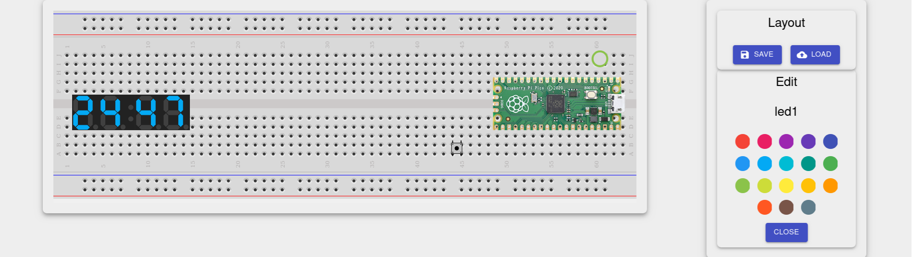

# Renode RP2040 Simulation (**WIP**)

> [!CAUTION]
> **_work in progress_** - it may contains bugs or incorrect simulators behaviour.

This repository contains RP2040 MCU simulation description for [Renode](https://github.com/renode/renode).
Currently supported peripherals described in peripherals section.

It is a framework to build your own board level simulations that uses RP2040.
There is predefined Raspberry Pico board description in: 'boards/raspberry_pico.repl'

# Supported Peripherals And Hardware 

|    Peripheral   |  Supported    | Known Limitations  |
|       :---:     |     :---:     |       :---:        |
|    **SIO**      |      $${\color{yellow}✓}$$       | Partially supported (multicore, dividers), limitations to be filled when known                 |
| **IRQ**  | $${\color{yellow}✓}$$ | Propagation from some peripherals is implemented |
| **DMA**  | $${\color{green}✓}$$  | DMA implemented with ringing and control blocks support |
| **Clocks** | $${\color{yellow}✓}$$ | Clocks are mostly just stubs, but with tree propagation, but virtual time is always correct | 
| **GPIO** | $${\color{green}✓}$$ | Pins manipulation implemented, with interrupts support. PIO may needs to be manually reevaluated due to CPU emulation (it's not step by step). Look for RP2040_SPI (PL022) peripheral as an example. Statuses may not be adequate to simplify simulation for now . |
| **XOSC** |  $${\color{green}✓}$$  | |
| **ROSC** | $${\color{green}✓}$$  | |
| **PLL** | $${\color{green}✓}$$  | |
| **SysConfig** | $${\color{red}✗}$$  | |
| **SysInfo** | $${\color{red}✗}$$  | | 
| **PIO** |  $${\color{yellow}✓}$$  | Manual reevaluation may be neccessary to synchronize PIO together with actions on MCU. IRQ and DMA not yet supported |
| **USB** | $${\color{red}✗}$$  |  |
| **UART** | $${\color{green}✓}$$  | Reimplemented PL011 to support DREQ generation for DMA and PIO interworking (in the future, not done yet) |
| **SPI** |  $${\color{yellow}✓}$$ | Clock configuration not yet supported. Only master mode implemented with only one mode. Interworking with PIO is implemented! |
| **I2C** |  $${\color{red}✗}$$  |  |
| **PWM** |  $${\color{red}✗}$$  |  |
| **Timers** | $${\color{yellow}✓}$$  | Alarms implemented, but not all registers |
| **Watchdog** | $${\color{green}✓}$$  | fully implemented, but tick generator is stubbed with just LimitTimer |
| **RTC** | $${\color{red}✗}$$  | |
| **ADC** | $${\color{yellow}✓}$$  | Implemented, but RESD files were not verified. Resets and IRQs to be checked and to be added in all cases. |
| **SSI** | $${\color{yellow}✓}$$  | Implemented, XIP support/caches are stubbed. Resets/IRQs/DMA requests to be filled |
| **XIP** | $${\color{yellow}✓}$$  | Partially implemented, bootrom correctly starts firmware |
| **Resets** | $${\color{green}✓}$$  | Device resetting works, added to support watchdog fully |
| **PSM** | $${\color{yellow}✓}$$  | Just a stub, doesn't reset anything, but model states |


# How PIO simulation works 

PIO is implemented as external simulator written in C++: `piosim` directory. Decision was made due to performance issues with C# implementation. 
Due to that PIO is modelled as additional CPU. 
Renode executes more than 1 step at once on given CPU, so manual synchronization is necessary in some cases, like interworking between SPI and PIO. 

> [!IMPORTANT]
> For Windows piosim.dll is delivered in piosim/redist directory
> If you want to modify you have to setup msys environment with mingw-gcc and mingw-make.
> Exactly the same as for Verilator modules: [CoSimulation Renode](https://renode.readthedocs.io/en/latest/tutorials/co-simulating-custom-hdl.html).
> Otherwise expect segmentation faults or Renode crashing on reading file header.


# How to use Raspberry Pico simulation

To use Raspberry Pico simulation clone Renode_RP2040 repository, then add path to it and include `boards/initialize_raspberry_pico.resc`. 

Example use:
```
(monitor) path add @repos/Renode_RP2040 
(monitor) include @boards/initialize_raspberry_pico.resc 
(raspberry_pico) sysbus LoadELF @repos/Renode_RP2040/pico-examples/build/hello_world/serial/
hello_serial.elf
(raspberry_pico) showAnalyzer sysbus.uart0
(raspberry_pico) start
```
> [!NOTE] 
> set VectorTableOffset to valid address for your firmware, for pico-examples it can be __VECTOR_TABLE symbol.

You may use it inside your simulation scripts, look at `tests/prepare.resc` as an example.

# How to define own board 
Raspberry Pico configuration may be extended to configure board connections. 
As an example you can check `tests/pio/clocked_input/raspberry_pico_with_redirected_spi.repl`.

Then you can include `boards/initalize_custom_board.resc` after setting $platform_file variable that points to your board.

```
$platform_file=@my_board.repl
include @boards/initialize_custom_board.resc
```

# Easy firmware execution 
In the root of repository, there is the `run_firmware.resc` script that configures RP2040 with specified firmware in ELF file. 

Just define your script or use renode console to use it.

```
$global.FIRMWARE=my_awesome_binary.elf
include @run_firmware.resc
```

If you need to use your own board: 
```
$platform_file=@my_awesome_board.repl
$global.FIRMWARE=my_awesome_binary.elf
include @run_firmware.resc
```

# Board visualization 
There is possibility to visualize board using python visualization plugin. 
> [!IMPORTANT]
> Only Raspberry Pico based boards are currently supported
> You can add buttons or leds and they will be automatically registered
> But totally different boards are not supported yet

To use it create python virtual env, then inside virtualenv:
```
pip3 install -r visualization/requirements.txt
renode --console your_simulation.resc

inside renode console:
(rasbperry_pico) startVisualization 8080 
```
and open localhost:8080 in your web browser.

Layouts are defined by user and can be saved in JSON file with `save` button inside `layout` section. 

Loading is supported from website or with `visualizationLoadLayout @path_to_file` command. 

Elements on PCB can be marked as board elements with `visualizationSetBoardElement <name>` command. 
But they are not rendered yet. This is planned feature. 

Example GUI may look like shown below: 


# Multi Node simulation. 
Many RP2040 simulators may interwork together. I am using that possibility in full MSPC simulation. To interwork between them GPIOConnector may be used, please check existing usage (`simulation` directory):
 [MSPC Board Simulation](https://github.com/matgla/mspc-south-bridge/) 

# Emulation accuracy 
Renode is using optimizations to speed up emulation executing huge number of instructions at once per core. 
This leads to accuracy problems which may be visible in some testing scenarios.
To improve accuracy you can use command: 
``` emulation SetGlobalQuantum "0.000001" ```
With value necessary for your needs. 

You can check example usages inside tests/pio/pio_blink/pio_blink.resc or tests/adc/adc_console/adc_console.resc.

# Renode Version

This respository is highly coupled with Renode version. 
Use this repository with Renode **1.15.3**

# Testing 
I am testing simulator code using official pico-examples and some custom made build on top of pico-examples. For more informations look at pico_example_patches. Current tests list with statuses: 

## ADC
| Example | Passed |
| :---: | :---:    |
| [adc_console](https://github.com/raspberrypi/pico-examples/tree/master/adc/adc_console) | $${\color{green}✓}$$ |
| [dma_capture](https://github.com/raspberrypi/pico-examples/tree/master/adc/dma_capture) | $${\color{green}✓}$$ |
| [hello_adc](https://github.com/raspberrypi/pico-examples/tree/master/adc/hello_adc) | $${\color{green}✓}$$ |
| [joystick_display](https://github.com/raspberrypi/pico-examples/tree/master/adc/joystick_display) | $${\color{green}✓}$$ | 
| [microphone_adc](https://github.com/raspberrypi/pico-examples/tree/master/adc/microphone_adc) | $${\color{green}✓}$$ | 
| [onboard_temperature](https://github.com/raspberrypi/pico-examples/tree/master/adc/onboard_temperature) | $${\color{green}✓}$$ | 
| [read_vsys](https://github.com/raspberrypi/pico-examples/tree/master/adc/read_vsys) | $${\color{green}✓}$$ | 

## Blink
| Example | Passed |
| :---: | :---:    |
| [blink](https://github.com/raspberrypi/pico-examples/tree/master/blink) | $${\color{green}✓}$$ |

## Clocks
| Example | Passed |
| :---: | :---:    |
| [detached_clk_peri](https://github.com/raspberrypi/pico-examples/tree/master/clocks/detached_clk_peri) | $${\color{green}✓}$$ |
| [hello_48MHz](https://github.com/raspberrypi/pico-examples/tree/master/clocks/hello_48MHz) | $${\color{green}✓}$$ | 
| [hello_gpout](https://github.com/raspberrypi/pico-examples/tree/master/clocks/hello_gpout) | $${\color{green}✓}$$ |
| [hello_resus](https://github.com/raspberrypi/pico-examples/tree/master/clocks/hello_resus) | $${\color{green}✓}$$ |

## Divider

| Example | Passed |
| :---: | :---:    |
| [divider](https://github.com/raspberrypi/pico-examples/tree/master/divider) | $${\color{green}✓}$$ |

## DMA
| Example | Passed |
| :---: | :---:    |
| [channel_irq](https://github.com/raspberrypi/pico-examples/tree/master/dma/channel_irq) | $${\color{green}✓}$$ |
| [control_blocks](https://github.com/raspberrypi/pico-examples/tree/master/dma/control_blocks) | $${\color{green}✓}$$ |
| [hello_dma](https://github.com/raspberrypi/pico-examples/tree/master/dma/hello_dma) | $${\color{green}✓}$$ |
| [sniff_crc](https://github.com/raspberrypi/pico-examples/tree/master/dma/sniff_crc) | $${\color{green}✓}$$ |

## Flash
| Example | Passed |
| :---: | :---:    |
| [cache_perfctr](https://github.com/raspberrypi/pico-examples/tree/master/flash/cache_perfctr) | $${\color{red}✗}$$ | 
| [nuke](https://github.com/raspberrypi/pico-examples/tree/master/flash/nuke) | $${\color{green}✓}$$ |
| [program](https://github.com/raspberrypi/pico-examples/tree/master/flash/program) | $${\color{green}✓}$$ |
| [ssi_dma](https://github.com/raspberrypi/pico-examples/tree/master/flash/ssi_dma) | $${\color{green}✓}$$ |
| [xip_stream](https://github.com/raspberrypi/pico-examples/tree/master/flash/xip_stream) | $${\color{red}✗}$$ |

## GPIO
| Example | Passed |
| :---: | :---:    |
| [dht_sensor](https://github.com/raspberrypi/pico-examples/tree/master/gpio/dht_sensor) | $${\color{red}✗}$$ |
| [hello_7segment](https://github.com/raspberrypi/pico-examples/tree/master/gpio/hello_7segment) | $${\color{red}✗}$$ |
| [hello_gpio_irq](https://github.com/raspberrypi/pico-examples/tree/master/gpio/hello_gpio_irq) | $${\color{red}✗}$$ |

## Hello World

| Example | Passed |
| :---: | :---:    |
| [serial](https://github.com/raspberrypi/pico-examples/tree/master/hello_world/serial) | $${\color{green}✓}$$ |
| [usb](https://github.com/raspberrypi/pico-examples/tree/master/hello_world/usb) | $${\color{red}✗}$$ |

## I2C
| Example | Passed |
| :---: | :---:    |
| [bmp280_i2c](https://github.com/raspberrypi/pico-examples/tree/master/i2c/bmp280_i2c) | $${\color{red}✗}$$ |
| [bus_scan](https://github.com/raspberrypi/pico-examples/tree/master/i2c/bus_scan) | $${\color{red}✗}$$ | 
| [ht16k33_i2c](https://github.com/raspberrypi/pico-examples/tree/master/i2c/ht16k33_i2c) | $${\color{red}✗}$$ |
| [lcd_1602_i2c](https://github.com/raspberrypi/pico-examples/tree/master/i2c/lcd_1602_i2c) | $${\color{red}✗}$$ |
| [lis3dh_i2c](https://github.com/raspberrypi/pico-examples/tree/master/i2c/lis3dh_i2c) | $${\color{red}✗}$$ |
| [mpc9808_i2c](https://github.com/raspberrypi/pico-examples/tree/master/i2c/mcp9808_i2c) | $${\color{red}✗}$$ |
| [mma8451_i2c](https://github.com/raspberrypi/pico-examples/tree/master/i2c/mma8451_i2c) | $${\color{red}✗}$$ |
| [mpl3115a2_i2c](https://github.com/raspberrypi/pico-examples/tree/master/i2c/mpl3115a2_i2c) | $${\color{red}✗}$$ |
| [mpu6050_i2c](https://github.com/raspberrypi/pico-examples/tree/master/i2c/mpu6050_i2c) | $${\color{red}✗}$$ |
| [pa1010d_i2c](https://github.com/raspberrypi/pico-examples/tree/master/i2c/pa1010d_i2c) | $${\color{red}✗}$$ |
| [pcf8523_i2c](https://github.com/raspberrypi/pico-examples/tree/master/i2c/pcf8523_i2c) | $${\color{red}✗}$$ |
| [slave_mem_i2c](https://github.com/raspberrypi/pico-examples/tree/master/i2c/slave_mem_i2c) | $${\color{red}✗}$$ |
| [ssd1306_i2c](https://github.com/raspberrypi/pico-examples/tree/master/i2c/ssd1306_i2c) | $${\color{red}✗}$$ |

## Interp

| Example | Passed |
| :---: | :---:    |
| [hello_interp](https://github.com/raspberrypi/pico-examples/tree/master/interp/hello_interp) | $${\color{red}✗}$$ |

## Multicore
| Example | Passed |
| :---: | :---:    |
| [hello_multicore](https://github.com/raspberrypi/pico-examples/tree/master/multicore/hello_multicore) | $${\color{green}✓}$$ |
| [multicore_fifo_irqs](https://github.com/raspberrypi/pico-examples/tree/master/multicore/multicore_fifo_irqs) | $${\color{green}✓}$$ |
| [multicore_runners](https://github.com/raspberrypi/pico-examples/tree/master/multicore/multicore_runner) | $${\color{green}✓}$$ |
| [multicore_runner_queue](https://github.com/raspberrypi/pico-examples/tree/master/multicore/multicore_runner_queue) | $${\color{green}✓}$$ |

## PIO
| Example | Passed |
| :---: | :---:    |
| [addition](https://github.com/raspberrypi/pico-examples/tree/master/pio/addition) | $${\color{green}✓}$$ |
| [apa102](https://github.com/raspberrypi/pico-examples/tree/master/pio/apa102) | $${\color{red}✗}$$ |
| [clocked_input](https://github.com/raspberrypi/pico-examples/tree/master/pio/clocked_input) | $${\color{green}✓}$$ |
| [differential_manchester](https://github.com/raspberrypi/pico-examples/tree/master/pio/differential_manchester) | $${\color{green}✓}$$ |
| [hello_pio](https://github.com/raspberrypi/pico-examples/tree/master/pio/hello_pio) | $${\color{green}✓}$$ |
| [hub75](https://github.com/raspberrypi/pico-examples/tree/master/pio/hub75) | $${\color{red}✗}$$ | 
| [i2c](https://github.com/raspberrypi/pico-examples/tree/master/pio/i2c) | $${\color{red}✗}$$ |
| [ir_nec](https://github.com/raspberrypi/pico-examples/tree/master/pio/ir_nec) | $${\color{red}✗}$$ |
| [logic_analyser](https://github.com/raspberrypi/pico-examples/tree/master/pio/logic_analyser) | $${\color{red}✗}$$ |
| [manchester_encoding](https://github.com/raspberrypi/pico-examples/tree/master/pio/manchester_encoding) | $${\color{red}✗}$$ | 
| [onewire](https://github.com/raspberrypi/pico-examples/tree/master/pio/onewire) | $${\color{red}✗}$$ |
| [pio_blink](https://github.com/raspberrypi/pico-examples/tree/master/pio/pio_blink) | $${\color{green}✓}$$ |
| [pwm](https://github.com/raspberrypi/pico-examples/tree/master/pio/pwm) | $${\color{red}✗}$$ |
| [quadrature_encoder](https://github.com/raspberrypi/pico-examples/tree/master/pio/quadrature_encoder) | $${\color{red}✗}$$ |
| [spi](https://github.com/raspberrypi/pico-examples/tree/master/pio/spi) | $${\color{red}✗}$$ |
| [squarewave](https://github.com/raspberrypi/pico-examples/tree/master/pio/squarewave) | $${\color{red}✗}$$ |
| [st7789_lcd](https://github.com/raspberrypi/pico-examples/tree/master/pio/st7789_lcd) | $${\color{red}✗}$$ |
| [uart_rx](https://github.com/raspberrypi/pico-examples/tree/master/pio/uart_rx) | $${\color{red}✗}$$ |
| [uart_tx](https://github.com/raspberrypi/pico-examples/tree/master/pio/uart_tx) | $${\color{red}✗}$$ |
| [ws2812](https://github.com/raspberrypi/pico-examples/tree/master/pio/ws2812) | $${\color{red}✗}$$ |

## PWM
| Example | Passed |
| :---: | :---:    |
| [hello_pwm](https://github.com/raspberrypi/pico-examples/tree/master/pwm/hello_pwm) | $${\color{red}✗}$$ |
| [led_fade](https://github.com/raspberrypi/pico-examples/tree/master/pwm/led_fade) | $${\color{red}✗}$$ |
| [measure_duty_cycle](https://github.com/raspberrypi/pico-examples/tree/master/pwm/measure_duty_cycle) | $${\color{red}✗}$$ |

## Reset
| Example | Passed |
| :---: | :---:    |
| [hello_reset](https://github.com/raspberrypi/pico-examples/tree/master/reset/hello_reset) | $${\color{red}✗}$$ |

## RTC
| Example | Passed |
| :---: | :---:    |
| [hello_rtc](https://github.com/raspberrypi/pico-examples/tree/master/rtc/hello_rtc) | $${\color{red}✗}$$ |
| [rtc_alarm](https://github.com/raspberrypi/pico-examples/tree/master/rtc/rtc_alarm) | $${\color{red}✗}$$ |
| [rtc_alarm_repeat](https://github.com/raspberrypi/pico-examples/tree/master/rtc/rtc_alarm_repeat) | $${\color{red}✗}$$ |

## SPI
| Example | Passed |
| :---: | :---:    |
| [bme280_spi](https://github.com/raspberrypi/pico-examples/tree/master/spi/bme280_spi) | $${\color{red}✗}$$ |
| [max7219_32x8_spi](https://github.com/raspberrypi/pico-examples/tree/master/spi/max7219_32x8_spi) | $${\color{red}✗}$$ |
| [max7219_8x7seg_spi](https://github.com/raspberrypi/pico-examples/tree/master/spi/max7219_8x7seg_spi) | $${\color{red}✗}$$ |
| [mpu9250_spi](https://github.com/raspberrypi/pico-examples/tree/master/spi/mpu9250_spi) | $${\color{red}✗}$$ |
| [spi_dma](https://github.com/raspberrypi/pico-examples/tree/master/spi/spi_dma) | $${\color{red}✗}$$ |
| [spi_flash](https://github.com/raspberrypi/pico-examples/tree/master/spi/spi_flash) | $${\color{red}✗}$$ |
| [spi_master_slave](https://github.com/raspberrypi/pico-examples/tree/master/spi/spi_master_slave) | $${\color{red}✗}$$ |

## System
| Example | Passed |
| :---: | :---:    |
| [hello_double_tap](https://github.com/raspberrypi/pico-examples/tree/master/system/hello_double_tap) | $${\color{red}✗}$$ |
| [narrow_io_write](https://github.com/raspberrypi/pico-examples/tree/master/system/narrow_io_write) | $${\color{red}✗}$$ |
| [unique_board_id](https://github.com/raspberrypi/pico-examples/tree/master/system/unique_board_id) | $${\color{red}✗}$$ |

# Timer
| Example | Passed |
| :---: | :---:    |
| [hello_timer](https://github.com/raspberrypi/pico-examples/tree/master/timer/hello_timer) | $${\color{green}✓}$$ |
| [periodic_sampler](https://github.com/raspberrypi/pico-examples/tree/master/timer/periodic_sampler) | $${\color{red}✗}$$ |
| [timer_lowlevel](https://github.com/raspberrypi/pico-examples/tree/master/timer/timer_lowlevel) | $${\color{green}✓}$$ |

# USB 
| Example | Passed |
| :---: | :---:    |
| [device](https://github.com/raspberrypi/pico-examples/tree/master/usb/device) | $${\color{red}✗}$$ |
| [dual](https://github.com/raspberrypi/pico-examples/tree/master/usb/dual) | $${\color{red}✗}$$ |
| [host](https://github.com/raspberrypi/pico-examples/tree/master/usb/host) | $${\color{red}✗}$$ | 

# Watchdog 
| Example | Passed |
| :---: | :---:    |
| [hello_watchdog](https://github.com/raspberrypi/pico-examples/tree/master/watchdog/hello_watchdog) | $${\color{green}✓}$$ |

# License 

MIT License

Copyright (c) 2024 Mateusz Stadnik (matgla@live.com)

Permission is hereby granted, free of charge, to any person obtaining a copy
of this software and associated documentation files (the "Software"), to deal
in the Software without restriction, including without limitation the rights
to use, copy, modify, merge, publish, distribute, sublicense, and/or sell
copies of the Software, and to permit persons to whom the Software is
furnished to do so, subject to the following conditions:

The above copyright notice and this permission notice shall be included in all
copies or substantial portions of the Software.

THE SOFTWARE IS PROVIDED "AS IS", WITHOUT WARRANTY OF ANY KIND, EXPRESS OR
IMPLIED, INCLUDING BUT NOT LIMITED TO THE WARRANTIES OF MERCHANTABILITY,
FITNESS FOR A PARTICULAR PURPOSE AND NONINFRINGEMENT. IN NO EVENT SHALL THE
AUTHORS OR COPYRIGHT HOLDERS BE LIABLE FOR ANY CLAIM, DAMAGES OR OTHER
LIABILITY, WHETHER IN AN ACTION OF CONTRACT, TORT OR OTHERWISE, ARISING FROM,
OUT OF OR IN CONNECTION WITH THE SOFTWARE OR THE USE OR OTHER DEALINGS IN THE
SOFTWARE.
